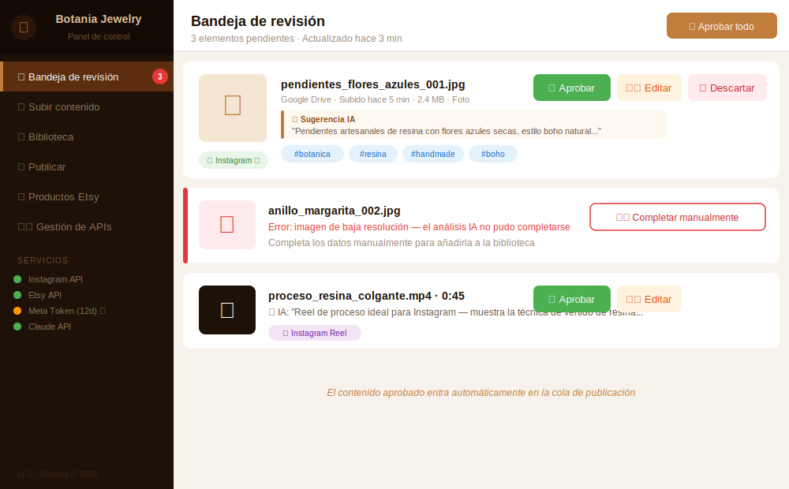
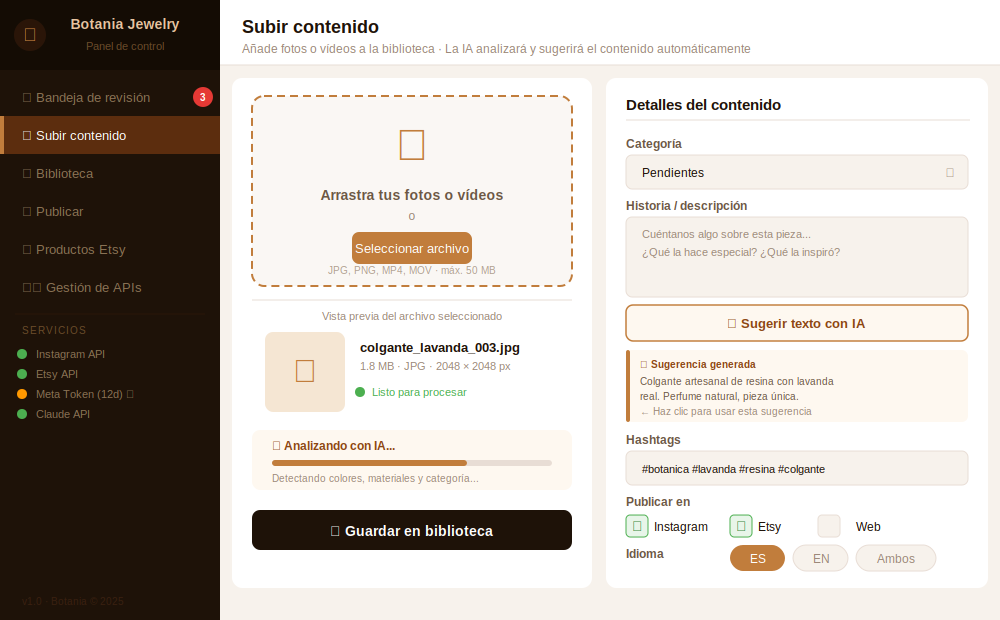
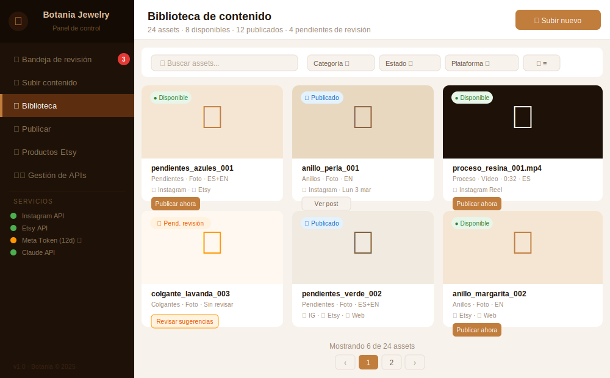
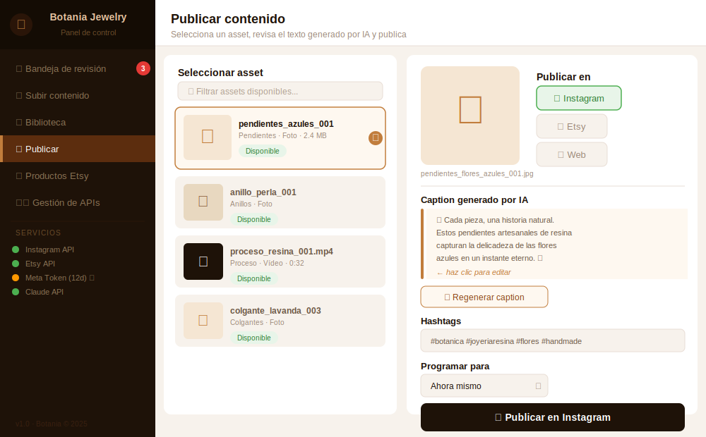

# 🌿 Botania Jewelry — Automatización de contenido con IA

Sistema de automatización de publicación de contenido para **Botania Jewelry**, negocio de joyería artesanal de resina. Combina inteligencia artificial, orquestación con N8N y un panel de control propio para gestionar la presencia digital con el mínimo esfuerzo.

---

## ¿Qué hace este sistema?

La gestora del negocio **sube una foto desde el móvil** y el sistema se encarga del resto:

```
📱 Sube foto a Google Drive
        ↓
🤖 La IA analiza la imagen
   → detecta el tipo de joya, colores y materiales
   → sugiere caption, hashtags y plataforma de destino
        ↓
✅ La gestora revisa y aprueba en 30 segundos
        ↓
🚀 N8N publica automáticamente en Instagram, Etsy o la web
```

Todo corre en **local** dentro de una máquina virtual, sin costes de servidor.

---

## Panel de control

Interfaz web accesible en `http://localhost:3000` con todo lo necesario en un solo lugar:

### 📥 Bandeja de revisión
Contenido subido desde el móvil con sugerencias automáticas de la IA — aprueba, edita o descarta en segundos.



---

### 📤 Subir contenido
Añade fotos o vídeos desde el PC. El botón **✨ Sugerir con IA** analiza la imagen y rellena automáticamente el texto, los hashtags y la categoría.



---

### 📚 Biblioteca de contenido
Vista general de todos los assets con filtros por categoría, estado y plataforma. Historial completo de publicaciones.



---

### 📱 Publicar
Selecciona un asset, elige la plataforma, revisa el caption generado por IA y publica — o prográmalo para más tarde.



---

### 📦 Productos Etsy
Crea listings completos en inglés con un clic. La IA genera título, descripción y tags a partir de las fotos del producto. La gestora solo añade precio y stock.


---

## Arquitectura

```
MÓVIL                     PC (gestora)
  │                           │
  ▼                           ▼
Google Drive ──────► Frontend (:3000)
  │                           │
  └──────────── N8N ──────────┘
                 │
         ┌───────┴────────┐
     Claude API        SQLite
    (IA + Vision)   (catálogo)
         │
         ▼
  Instagram · Web · Etsy
```

- **VM local** (VMware) con Ubuntu Server + Docker — corre en background
- **Google Drive** — canal de entrada de contenido desde el móvil
- **N8N** — orquestador de todos los flujos automáticos
- **Claude Vision** — analiza imágenes y genera texto adaptado a cada plataforma
- **FastAPI** — backend del panel de control
- **SQLite** — base de datos ligera del catálogo de assets

---

## Documentación

### Diseño del sistema

| Documento | Descripción |
|-----------|-------------|
| [Visión del proyecto](docs/01-vision.md) | Objetivos, casos de uso y alcance |
| [Arquitectura](docs/02-arquitectura.md) | Diseño técnico, flujos y diagrama del sistema |
| [Stack tecnológico](docs/03-stack.md) | Herramientas, versiones y variables de entorno |
| [Fases del proyecto](docs/04-fases.md) | Hoja de ruta con 6 fases e hitos |
| [Biblioteca de contenido](docs/05-biblioteca-contenido.md) | Estados de assets, esquema SQLite y reglas de selección |
| [MCPs e integraciones](docs/06-mcps-e-integraciones.md) | MCPs de Claude, generación de imágenes y captura de comentarios |
| [Frontend — Panel de control](docs/07-frontend.md) | Mockups y descripción de cada sección |

### Guías de instalación

| Guía | Descripción |
|------|-------------|
| [00 — VM Ubuntu Server](docs/setup/00-vm-ubuntu.md) | Crear la VM, configurar red NAT + Host-Only ✅ |
| [01 — Docker](docs/setup/01-docker.md) | Instalar Docker Engine + Docker Compose |
| [02 — N8N](docs/setup/02-n8n.md) | Levantar N8N con Docker Compose ✅ |
| [03 — SQLite](docs/setup/03-sqlite.md) | Base de datos SQLite (esquema, vistas, integración N8N) |
| 04 — Frontend | Desplegar el panel de control *(próximamente)* |
| 05 — Google Drive | Configurar la integración con Drive *(próximamente)* |

---

## Estado actual

> **Fase 0** — Infraestructura y documentación inicial ✅ · En progreso

Completado: VM · Red · Docker · N8N
Pendiente: base de datos SQLite · variables de entorno (.env)

---

## Stack resumido

| Capa | Tecnología |
|------|-----------|
| Virtualización | VMware Workstation / Player |
| Automatización | N8N (self-hosted) |
| Frontend | FastAPI + HTML/JS |
| IA | Anthropic Claude (Vision + texto) |
| Imágenes IA | Flux via Replicate |
| Cloud media | Google Drive |
| Base de datos | SQLite |
| Publicación | Meta Graph API · Etsy API v3 · CMS API |

**Coste mensual estimado: ~€10–20** (solo APIs de IA según uso)

---

## Estructura del repositorio

```
Botaniajewelry/
├── docs/
│   ├── mockups/            # Mockups SVG del frontend
│   ├── setup/              # Guías de instalación paso a paso
│   ├── 01-vision.md
│   ├── 02-arquitectura.md
│   ├── 03-stack.md
│   ├── 04-fases.md
│   ├── 05-biblioteca-contenido.md
│   ├── 06-mcps-e-integraciones.md
│   └── 07-frontend.md
├── infra/                  # Configuración de infraestructura (VM)
│   └── docker-compose.yml  # Servicios Docker (N8N + volúmenes)
├── database/               # Base de datos SQLite
│   ├── schema.sql          # Esquema de tablas y vistas
│   └── init.sh             # Script de inicialización
├── workflows/              # Workflows de N8N exportados (JSON)
├── prompts/                # Prompts de IA por plataforma
├── frontend/               # Código del panel de control (FastAPI)
├── .env.example            # Plantilla de variables de entorno
└── .gitignore
```
